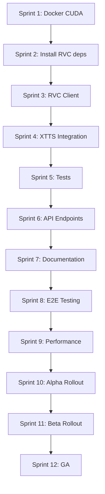

# IMPLEMENTATION_RVC – Integração RVC + XTTS v2

**Data:** 27 de Novembro de 2025  
**Autor:** Engenheira Sênior de Áudio e Backend  
**Status:** Análise Técnica Completa  
**Objetivo:** Adicionar naturalidade, entonação e emoção aos áudios gerados

---

## 📋 ÍNDICE

1. [Visão Geral](#1-visão-geral)
2. [Arquitetura do tts-with-rvc](#2-arquitetura-do-tts-with-rvc)
3. [Arquitetura Atual do Microserviço (XTTS)](#3-arquitetura-atual-do-microserviço-xtts)
4. [Proposta de Integração RVC no XTTS](#4-proposta-de-integração-rvc-no-xtts)
5. [Boas Práticas e Decisões Técnicas](#5-boas-práticas-e-decisões-técnicas)
6. [Impacto em Testes e Qualidade](#6-impacto-em-testes-e-qualidade)
7. [Riscos, Desafios e Recomendações](#7-riscos-desafios-e-recomendações)
8. [Cronograma de Implementação (Overview)](#8-cronograma-de-implementação-overview)

---

## 1. VISÃO GERAL

### 1.1 Objetivo da Integração

Integrar **RVC (Retrieval-based Voice Conversion)** como pós-processador dos áudios gerados pelo **XTTS v2**, com o objetivo de:

- ✅ **Aumentar naturalidade** - Reduzir artefatos sintéticos residuais
- ✅ **Melhorar entonação** - Controle fino de pitch e prosódia
- ✅ **Adicionar emoção** - Expressividade e variação emocional

### 1.2 Resumo do tts-with-rvc

O projeto `tts-with-rvc` (https://github.com/Atm4x/tts-with-rvc) é uma biblioteca Python que combina **Edge TTS** (para geração inicial) com **RVC** (para conversão de voz), criando um pipeline TTS → RVC que melhora significativamente a qualidade final do áudio.

**Características principais:**
- **Versão:** 0.1.9 (PyPI: `pip install tts-with-rvc`)
- **Arquitetura:** Pipeline TTS base → RVC voice conversion
- **Engine RVC:** Baseado em https://github.com/RVC-Project/
- **TTS padrão:** Edge TTS (Microsoft)
- **Pitch Extraction:** RMVPE, FCPE, PM, Harvest, DIO, Crepe
- **GPU Support:** CUDA, MPS (CPU lento ~10-30x)
- **Python:** <=3.12 (testado em 3.10-3.12)

**Vantagens do RVC:**
- Zero-shot voice conversion (não precisa treinar)
- Suporte a modelos `.pth` pré-treinados
- Index files (`.index`) para melhor precisão
- Controle fino de pitch (semitones)
- Ajustes de volume envelope (rms_mix_rate)
- Proteção de consoantes e respiração (protect)

### 1.3 Como se Relaciona com Nosso Microserviço

No contexto do nosso microserviço `audio-voice`:

**Estado Atual:**
```
Texto → XTTS v2 → Áudio WAV (24kHz)
```

**Estado Proposto:**
```
Texto → XTTS v2 → RVC Post-Processing → Áudio WAV Melhorado (24kHz)
```

O RVC entraria como um **pós-processador opcional**, aplicável via:
- Parâmetro de API (`enable_rvc=True/False`)
- Quality profile customizado (`EXPRESSIVE_RVC`)
- Modelo RVC selecionável por voz clonada

---

## 2. ARQUITETURA DO tts-with-rvc

### 2.1 Fluxo TTS → RVC

O pipeline do `tts-with-rvc` funciona em **2 etapas sequenciais**:

```
┌─────────────────────────────────────────────────┐
│ ETAPA 1: Text-to-Speech (Edge TTS)             │
│                                                 │
│ Input: Text                                     │
│   ↓                                             │
│ Edge TTS Generation                             │
│   ↓                                             │
│ Output: temp_audio.wav                          │
└─────────────────────────────────────────────────┘
                    ↓
┌─────────────────────────────────────────────────┐
│ ETAPA 2: Voice Conversion (RVC)                 │
│                                                 │
│ Input: temp_audio.wav                           │
│   ↓                                             │
│ Load RVC Model (.pth)                           │
│   ↓                                             │
│ Apply Voice Conversion:                         │
│   - Pitch extraction (RMVPE/FCPE)               │
│   - Feature extraction (Hubert)                 │
│   - Index retrieval (optional)                  │
│   - Neural vocoder synthesis                    │
│   ↓                                             │
│ Output: converted_audio.wav                     │
└─────────────────────────────────────────────────┘
```

### 2.2 Principais Módulos e Classes

Baseado na análise do código-fonte:

#### 2.2.1 `TTS_RVC` Class (inference.py)

Interface principal de alto nível.

```python
class TTS_RVC:
    def __init__(
        self,
        model_path,              # Path para modelo RVC (.pth)
        tmp_directory=None,      # Diretório temp para TTS
        voice="ru-RU-DmitryNeural",  # Voz Edge TTS
        index_path="",           # Path para index file (.index)
        f0_method="rmvpe",       # Método de extração de pitch
        device=None,             # 'cuda:0', 'cpu', 'mps:0'
        output_directory=None    # Diretório de saída
    ):
        # Inicializa pools de threads
        self.pool = concurrent.futures.ThreadPoolExecutor()
        
        # Configuração de voz e modelo
        self.current_voice = voice
        self.current_model = model_path
        self.index_path = index_path
        self.f0_method = f0_method
        self.device = device
    
    def __call__(
        self,
        text,                    # Texto para síntese
        pitch=0,                 # Pitch shift em semitones
        tts_rate=0,              # Taxa de fala (Edge TTS)
        tts_volume=0,            # Volume (Edge TTS)
        index_rate=0.75,         # Contribuição do index (0-1)
        is_half=True,            # Half-precision (FP16)
        f0method=None,           # Override f0 method
        filter_radius=3,         # Median filter (breathiness)
        resample_sr=0,           # Resample rate (0=sem resample)
        rms_mix_rate=0.5,        # Volume envelope scaling
        protect=0.33,            # Proteção de consoantes
        verbose=False
    ) -> str:
        # 1. Chama Edge TTS para gerar áudio base
        # 2. Chama rvc_convert() para aplicar voice conversion
        # 3. Retorna path do áudio final
        ...
    
    def voiceover_file(
        self,
        input_path,              # Path de áudio existente
        pitch=0,
        ... # Mesmos parâmetros RVC
    ) -> str:
        # Aplica RVC diretamente em arquivo de áudio
        # (sem TTS, apenas conversão)
        ...
```

#### 2.2.2 `rvc_convert()` Function (vc_infer.py)

Core da conversão RVC.

```python
def rvc_convert(
    model_path,              # Modelo RVC (.pth)
    f0_up_key=0,             # Pitch shift (semitones)
    input_path=None,         # Áudio de entrada
    output_dir_path=None,    # Diretório de saída
    _is_half=None,           # Half-precision
    f0method="rmvpe",        # Método de pitch extraction
    file_index="",           # Index file principal
    file_index2="",          # Index file secundário
    index_rate=1,            # Contribuição do index (0-1)
    filter_radius=3,         # Median filter para pitch
    resample_sr=0,           # Sample rate final
    rms_mix_rate=0.5,        # Volume envelope scaling
    protect=0.33,            # Proteção de consoantes
    verbose=False,
    device=None,
    output_filename="out.wav"
) -> str:
    # 1. Valida device (CUDA/CPU/MPS)
    # 2. Carrega modelo RVC via vc.get_vc(model_path)
    # 3. Chama vc.vc_single() para conversão
    # 4. Retorna path do áudio convertido
    ...
```

#### 2.2.3 `VC` Class (infer/vc/modules.py)

Gerenciador de modelos RVC.

```python
class VC:
    def __init__(self, config):
        self.config = config
        self.hubert_model = None  # Carregado sob demanda
        self.net_g = None         # Modelo RVC carregado
        ...
    
    def get_vc(self, sid):
        """
        Carrega modelo RVC (.pth)
        
        Args:
            sid: Path do modelo (.pth)
        """
        # 1. Lê checkpoint torch (.pth)
        # 2. Extrai configuração e pesos
        # 3. Instancia arquitetura correta:
        #    - SynthesizerTrnMs256NSFsid
        #    - SynthesizerTrnMs256NSFsid_nono
        #    - SynthesizerTrnMs768NSFsid
        #    - SynthesizerTrnMs768NSFsid_nono
        # 4. Carrega pesos no modelo
        # 5. Move para device (CUDA/CPU)
        ...
    
    def load_hubert(self, config, file_path="hubert_base.pt"):
        """
        Carrega modelo Hubert para extração de features
        
        - Download automático de HuggingFace se necessário
        - Cache em ./hubert_base.pt
        """
        ...
    
    def vc_single(
        self,
        sid,                 # Model ID
        input_audio_path,    # Path de entrada
        f0_up_key,           # Pitch shift
        f0_file,             # Arquivo de pitch (opcional)
        f0_method,           # Método de extração
        file_index,          # Index file
        file_index2,         # Index file 2
        index_rate,          # Taxa de index
        filter_radius,       # Filtro median
        resample_sr,         # Resample
        rms_mix_rate,        # Volume envelope
        protect              # Proteção
    ):
        """
        Realiza voice conversion em arquivo de áudio
        
        Pipeline interno:
        1. Load áudio via load_audio()
        2. Chama pipeline.pipeline() para conversão
        3. Retorna sample_rate e áudio convertido
        """
        ...
```

#### 2.2.4 `Pipeline` Class (infer/vc/pipeline.py)

Orquestrador do pipeline de conversão.

```python
class Pipeline(object):
    def __init__(self, tgt_sr, config):
        self.sr = tgt_sr           # Sample rate alvo
        self.config = config
        self.device = config.device
        self.is_half = config.is_half
        
        # Modelos de pitch extraction (lazy load)
        self.model_rmvpe = None    # RMVPE
        self.model_fcpe = None     # FCPE
        
        # Configurações de janela
        self.window = 160          # Window size
        self.t_pad = self.sr * self.window // 16000
        self.t_pad2 = self.t_pad * 2
        self.t_pad_tgt = self.t_pad2
        self.t_query = self.t_pad * 3
    
    def get_f0(
        self,
        input_audio_path,
        x,                   # Áudio numpy array
        p_len,               # Pitch length
        f0_up_key,           # Pitch shift
        f0_method,           # rmvpe, fcpe, pm, harvest, dio, crepe
        filter_radius,
        inp_f0=None,
        crepe_hop_length=160,
        fcpe_threshold=0.05
    ):
        """
        Extrai pitch (F0) do áudio usando método selecionado
        
        Métodos disponíveis:
        - **rmvpe**: Robust Model for Vocal Pitch Estimation (RECOMENDADO)
          - Download automático: rmvpe.pt (HuggingFace)
          - Mais robusto para voz cantada/falada
          
        - **fcpe**: Fast and Clean Pitch Estimator (FP32 only)
          - Download automático: fcpe.pt (HuggingFace)
          - Mais rápido, apenas float32
          
        - **pm**: Parselmouth (Praat-based)
          - Sem downloads, usa biblioteca nativa
          - Bom para fala clara
          
        - **harvest**: Harvest pitch extractor
          - Sem downloads, usa PyWorld
          - Lento, alta precisão
          
        - **dio**: DIO pitch extractor
          - Sem downloads, usa PyWorld
          - Rápido, precisão média
          
        - **crepe**: CNN-based pitch estimator
          - Download via torchcrepe
          - Alta precisão, GPU intensivo
        
        Returns:
            f0, f0_coarse (pitch arrays)
        """
        ...
    
    def vc(
        self,
        model,           # Modelo Hubert
        net_g,           # Modelo RVC (generator)
        sid,             # Speaker ID
        audio0,          # Áudio de entrada (features)
        pitch,           # Pitch array
        pitchf,          # Pitch fine array
        times,           # Timings
        index,           # FAISS index
        big_npy,         # Index embeddings
        index_rate,      # Taxa de index
        version,         # v1/v2
        protect          # Proteção
    ):
        """
        Aplica voice conversion usando modelo RVC
        
        Pipeline:
        1. Extrai features com Hubert
        2. Aplica index retrieval (se index_rate > 0)
        3. Interpola features
        4. Aplica proteção de consoantes (se protect < 0.5)
        5. Gera áudio com vocoder neural (net_g)
        6. Retorna áudio convertido
        """
        ...
    
    def pipeline(
        self,
        model,           # Modelo Hubert
        net_g,           # Modelo RVC
        sid,             # Speaker ID
        audio,           # Áudio de entrada (waveform)
        input_audio_path,
        times,           # [0, 0, 0] para tracking
        f0_up_key,       # Pitch shift
        f0_method,       # Método de pitch
        file_index,      # Index file
        index_rate,      # Taxa de index
        if_f0,           # Se usa pitch (1=sim, 0=não)
        filter_radius,   # Filtro median
        tgt_sr,          # Sample rate alvo
        resample_sr,     # Resample intermediário
        rms_mix_rate,    # Volume envelope
        version,         # v1/v2
        protect,         # Proteção
        f0_file=None,
        crepe_hop_length=160,
        fcpe_threshold=0.05
    ):
        """
        Pipeline completo de conversão de voz
        
        Etapas:
        1. Carrega index FAISS (se fornecido)
        2. Aplica filtro butterworth no áudio
        3. Padding do áudio
        4. Extrai pitch com get_f0()
        5. Divide áudio em chunks
        6. Processa cada chunk com vc()
        7. Concatena resultados
        8. Aplica RMS mixing (volume envelope)
        9. Resample final
        10. Retorna áudio convertido
        """
        ...
```

### 2.3 Principais Dependências

Extraídas de `setup.py` e análise do código:

```python
install_requires = [
    # TTS
    "edge-tts>=6.1.17",           # Text-to-Speech (Microsoft Edge)
    
    # Audio Processing
    "soundfile>=0.12.1",          # Read/Write audio files
    "librosa>=0.10.1",            # Audio analysis
    "scipy>=1.12.0",              # Signal processing
    "audioread>=3.0.1",           # Audio file backend
    "pyloudnorm>=0.1.1",          # Loudness normalization
    
    # RVC Core
    "torch",                      # PyTorch (install separately with CUDA)
    "torchaudio",                 # Audio for PyTorch
    "torchvision",                # Vision (dependency)
    "torchcrepe>=0.0.23",        # Crepe pitch estimator
    "fairseq",                    # Hubert model
    "faiss-cpu>=1.7.4; platform_system != 'Windows'",  # Index retrieval (CPU)
    "faiss-gpu; platform_system != 'Windows'",         # Index retrieval (GPU)
    
    # Pitch Extraction
    "praat-parselmouth>=0.4.3",   # PM method
    "pyworld>=0.3.4",             # Harvest, DIO methods
    
    # Utilities
    "numpy>=1.23.5",
    "numba>=0.56.4; python_version < '3.12'",
    "resampy>=0.4.2",
    "pydub>=0.25.1",
    "nest-asyncio>=1.5.8",
    "requests>=2.31.0",
    "tqdm>=4.66.1",
    "huggingface-hub>=0.20.0"     # Download models
]
```

**Observações importantes:**
- **PyTorch:** Deve ser instalado ANTES com suporte CUDA:
  ```bash
  pip install torch torchvision torchaudio --index-url https://download.pytorch.org/whl/cu121
  ```
- **fairseq:** Conflitos em Windows/Python 3.10+, usam `fairseq-fixed`
- **CUDA:** Essencial para performance (CPU é 10-30x mais lento)

### 2.4 Estrutura de Pastas do Projeto

```
tts_with_rvc/
├── __init__.py              # Exports TTS_RVC
├── inference.py             # TTS_RVC class (high-level API)
├── vc_infer.py              # rvc_convert() function
└── infer/
    ├── lib/
    │   ├── audio.py         # load_audio(), wav2()
    │   ├── rmvpe.py         # RMVPE pitch extractor
    │   └── infer_pack/
    │       ├── models.py    # Synthesizer architectures
    │       └── f0_modules/
    │           └── F0Predictor/
    │               └── FCPE.py  # FCPE pitch extractor
    └── vc/
        ├── modules.py       # VC class (model manager)
        ├── pipeline.py      # Pipeline class (conversion orchestrator)
        └── config.py        # Config class (device, precision)
```

---

## 3. ARQUITETURA ATUAL DO MICROSERVIÇO (XTTS)

### 3.1 Como o XTTS está Plugado Hoje

Nosso microserviço atual tem a seguinte arquitetura:

```
┌──────────────────────────────────────────────────────────────┐
│                    FastAPI (main.py)                          │
│                                                               │
│  POST /jobs                                                   │
│    ↓                                                          │
│  Create Job (models.Job)                                      │
│    ↓                                                          │
│  Enqueue Celery Task (celery_tasks.process_dubbing_job)      │
└──────────────────────────────────────────────────────────────┘
                              ↓
┌──────────────────────────────────────────────────────────────┐
│                  Celery Worker (run_celery.py)                │
│                                                               │
│  Task: process_dubbing_job                                    │
│    ↓                                                          │
│  VoiceProcessor.process_dubbing_job()                         │
│    ↓                                                          │
│  XTTSClient.generate_dubbing()                                │
│    ├─ Load Model (tts_models/multilingual/multi-dataset/xtts_v2) │
│    ├─ Apply Quality Profile params                            │
│    ├─ TTS Inference (TTS.tts_to_file)                         │
│    └─ Return audio_bytes, duration                            │
│                                                               │
│  Save to /app/processed/{job_id}.wav                          │
│  Update Job status=COMPLETED                                  │
└──────────────────────────────────────────────────────────────┘
```

### 3.2 Pontos Chave de Saída de Áudio

**Arquivo:** `app/xtts_client.py`  
**Método:** `generate_dubbing()`

```python
async def generate_dubbing(
    self,
    text: str,
    language: str,
    voice_preset: Optional[str] = None,
    voice_profile: Optional[VoiceProfile] = None,
    quality_profile: QualityProfile = QualityProfile.BALANCED,
    temperature: Optional[float] = None,
    speed: Optional[float] = None
) -> Tuple[bytes, float]:
    # ...
    
    # Output temporário
    output_path = f"/tmp/xtts_output_{os.getpid()}_{datetime.now().timestamp()}.wav"
    
    # Gera áudio com XTTS
    await loop.run_in_executor(
        None,
        lambda: self.tts.tts_to_file(
            text=text,
            file_path=output_path,
            speaker_wav=speaker_wav,
            language=normalized_lang,
            split_sentences=params.enable_text_splitting,
            speed=params.speed
        )
    )
    
    # Lê arquivo gerado
    audio_data, sr = sf.read(output_path)
    
    # Converte para bytes (WAV format)
    buffer = io.BytesIO()
    sf.write(buffer, audio_data, sr, format='WAV')
    audio_bytes = buffer.getvalue()
    
    # Cleanup
    if os.path.exists(output_path):
        os.remove(output_path)
    
    return audio_bytes, duration
```

**Ponto de Extensão:** Entre `sf.read(output_path)` e `sf.write(buffer, ...)` é onde podemos inserir o **pós-processamento RVC**.

### 3.3 Como os Endpoints da API são Estruturados

**Arquivo:** `app/main.py`

```python
@app.post("/jobs", response_model=Job)
async def create_dubbing_job(request: DubbingRequest):
    # 1. Valida request
    # 2. Cria Job (models.Job.create_new)
    # 3. Salva em Redis (job_store.create_job)
    # 4. Enfileira task Celery
    # 5. Retorna Job
    ...

@app.get("/jobs/{job_id}", response_model=Job)
async def get_job_status(job_id: str):
    # Retorna status do job do Redis
    ...

@app.get("/jobs/{job_id}/download")
async def download_job_audio(job_id: str):
    # Retorna FileResponse com áudio gerado
    ...
```

**Request Model:**

```python
class DubbingRequest(BaseModel):
    mode: JobMode = JobMode.DUBBING
    text: str
    source_language: str
    voice_preset: Optional[str] = None      # Voz genérica
    voice_id: Optional[str] = None          # Voz clonada
    speed: Optional[float] = 1.0
    quality_profile: QualityProfile = QualityProfile.BALANCED
```

**Pontos de Extensão:**
- Adicionar campo `enable_rvc: bool = False` em `DubbingRequest`
- Adicionar campo `rvc_model_id: Optional[str] = None` para selecionar modelo RVC
- Adicionar parâmetros RVC: `rvc_pitch`, `rvc_index_rate`, `rvc_protect`, etc.

---

## 4. PROPOSTA DE INTEGRAÇÃO RVC NO XTTS

### 4.1 Fluxo Proposto

```
┌───────────────────────────────────────────────────────────────┐
│                    CLIENT REQUEST                              │
│                                                               │
│  POST /jobs                                                   │
│  {                                                            │
│    "text": "Texto para dublar",                              │
│    "source_language": "pt",                                   │
│    "quality_profile": "expressive",                           │
│    "enable_rvc": true,          ← NOVO                        │
│    "rvc_model_id": "model_abc", ← NOVO (opcional)             │
│    "rvc_pitch": 2,              ← NOVO (opcional)             │
│    "rvc_index_rate": 0.75       ← NOVO (opcional)             │
│  }                                                            │
└───────────────────────────────────────────────────────────────┘
                          ↓
┌───────────────────────────────────────────────────────────────┐
│               XTTS GENERATION (Etapa 1)                        │
│                                                               │
│  XTTSClient.generate_dubbing()                                │
│    ↓                                                          │
│  TTS.tts_to_file() → /tmp/xtts_raw_{job_id}.wav              │
│    ↓                                                          │
│  Load audio: audio_data, sr = sf.read(output_path)            │
└───────────────────────────────────────────────────────────────┘
                          ↓
┌───────────────────────────────────────────────────────────────┐
│            RVC POST-PROCESSING (Etapa 2) ← NOVO                │
│                                                               │
│  if job.enable_rvc:                                           │
│    ↓                                                          │
│    RvcClient.convert_audio()                                  │
│      ├─ Load RVC Model (.pth)                                 │
│      ├─ Extract Pitch (RMVPE)                                 │
│      ├─ Extract Features (Hubert)                             │
│      ├─ Apply Index Retrieval (optional)                      │
│      ├─ Neural Vocoder Synthesis                              │
│      └─ Return improved_audio_data                            │
│    ↓                                                          │
│    audio_data = improved_audio_data                           │
└───────────────────────────────────────────────────────────────┘
                          ↓
┌───────────────────────────────────────────────────────────────┐
│                  FINALIZATION                                  │
│                                                               │
│  sf.write(buffer, audio_data, sr, format='WAV')               │
│  audio_bytes = buffer.getvalue()                              │
│  Save to /app/processed/{job_id}.wav                          │
│  Return to client                                             │
└───────────────────────────────────────────────────────────────┘
```

### 4.2 Pontos de Integração no Código

#### 4.2.1 Novo Módulo: `app/rvc_client.py`

```python
"""
Cliente RVC - Adapter para voice conversion e melhoria de naturalidade
Baseado em tts-with-rvc (https://github.com/Atm4x/tts-with-rvc)
"""
import logging
import os
import torch
import soundfile as sf
import numpy as np
from pathlib import Path
from typing import Optional, Tuple

from .models import RvcModel, RvcParameters
from .exceptions import RvcConversionException
from .config import get_settings

logger = logging.getLogger(__name__)


class RvcClient:
    """
    Cliente RVC para pós-processamento de áudio XTTS
    
    Funciona como camada de conversão de voz sobre áudio já gerado,
    melhorando naturalidade, entonação e emoção.
    """
    
    def __init__(
        self,
        device: Optional[str] = None,
        fallback_to_cpu: bool = True,
        models_dir: str = "./models/rvc"
    ):
        """
        Inicializa cliente RVC
        
        Args:
            device: 'cpu' ou 'cuda' (auto-detecta se None)
            fallback_to_cpu: Se True, usa CPU quando CUDA não disponível
            models_dir: Diretório de modelos RVC (.pth)
        """
        # Device detection (igual XTTS)
        if device is None:
            self.device = 'cuda' if torch.cuda.is_available() else 'cpu'
        else:
            self.device = device
            if device == 'cuda' and not torch.cuda.is_available():
                if fallback_to_cpu:
                    logger.warning("CUDA requested but not available, falling back to CPU for RVC")
                    self.device = 'cpu'
                else:
                    raise RuntimeError("CUDA requested but not available")
        
        logger.info(f"Initializing RVC client on device: {self.device}")
        
        self.models_dir = Path(models_dir)
        self.models_dir.mkdir(exist_ok=True, parents=True)
        
        # Lazy load de VC (semelhante ao XTTS)
        self.vc = None
        self.current_model_path = None
        
        # Cache de modelos carregados
        self.loaded_models = {}
    
    def _load_vc(self):
        """Carrega módulo VC (lazy initialization)"""
        if self.vc is not None:
            return
        
        try:
            # Import dinâmico para evitar dependências até necessário
            from tts_with_rvc.infer.vc.modules import VC
            from tts_with_rvc.infer.vc.config import Config
            
            logger.info("Initializing RVC VC module")
            
            config = Config()
            config.device = self.device
            config.is_half = (self.device == 'cuda')  # FP16 apenas em GPU
            
            self.vc = VC(config)
            
            logger.info("RVC VC module loaded successfully")
            
        except ImportError as e:
            raise RvcConversionException(
                f"Failed to import RVC modules. Install: pip install tts-with-rvc. Error: {e}"
            )
    
    async def convert_audio(
        self,
        audio_data: np.ndarray,
        sample_rate: int,
        rvc_model: RvcModel,
        params: RvcParameters
    ) -> Tuple[np.ndarray, float]:
        """
        Aplica RVC conversion em áudio XTTS gerado
        
        Args:
            audio_data: Audio numpy array (waveform)
            sample_rate: Sample rate do áudio (24000 para XTTS)
            rvc_model: Modelo RVC a usar (com path, index, etc.)
            params: Parâmetros de conversão (pitch, index_rate, etc.)
        
        Returns:
            Tuple[np.ndarray, float]: (audio convertido, duração em segundos)
        
        Raises:
            RvcConversionException: Se conversão falhar
        """
        # Garante que VC esteja carregado
        if self.vc is None:
            self._load_vc()
        
        try:
            # Salva áudio temporário (RVC espera arquivo)
            temp_input = f"/tmp/rvc_input_{os.getpid()}.wav"
            sf.write(temp_input, audio_data, sample_rate)
            
            # Carrega modelo RVC se necessário
            if self.current_model_path != rvc_model.model_path:
                logger.info(f"Loading RVC model: {rvc_model.model_path}")
                self.vc.get_vc(rvc_model.model_path)
                self.current_model_path = rvc_model.model_path
            
            # Aplica voice conversion
            logger.info(f"Applying RVC conversion with params: pitch={params.pitch}, "
                       f"index_rate={params.index_rate}, f0_method={params.f0_method}")
            
            # Chama vc_single (síncronamente, RVC não é async)
            import asyncio
            loop = asyncio.get_event_loop()
            
            tgt_sr, audio_opt = await loop.run_in_executor(
                None,
                lambda: self.vc.vc_single(
                    sid=0,  # Speaker ID (não usado para single model)
                    input_audio_path=temp_input,
                    f0_up_key=params.pitch,
                    f0_file=None,
                    f0_method=params.f0_method,
                    file_index=rvc_model.index_path if rvc_model.index_path else "",
                    file_index2="",
                    index_rate=params.index_rate,
                    filter_radius=params.filter_radius,
                    resample_sr=params.resample_sr,
                    rms_mix_rate=params.rms_mix_rate,
                    protect=params.protect
                )
            )
            
            # Cleanup temp
            if os.path.exists(temp_input):
                os.remove(temp_input)
            
            # Calcula duração
            duration = len(audio_opt) / tgt_sr
            
            logger.info(f"RVC conversion completed: {duration:.2f}s, sample_rate={tgt_sr}")
            
            return audio_opt, duration
            
        except Exception as e:
            logger.error(f"RVC conversion failed: {e}", exc_info=True)
            raise RvcConversionException(f"RVC conversion error: {str(e)}")
```

#### 4.2.2 Modelos Adicionados: `app/models.py`

```python
class RvcModel(BaseModel):
    """Modelo RVC para voice conversion"""
    id: str
    name: str
    description: Optional[str] = None
    model_path: str          # Path para arquivo .pth
    index_path: Optional[str] = None  # Path para arquivo .index (opcional)
    language: Optional[str] = None    # Idioma otimizado (opcional)
    created_at: datetime
    file_size: Optional[int] = None
    
    @classmethod
    def create_new(
        cls,
        name: str,
        model_path: str,
        index_path: Optional[str] = None,
        description: Optional[str] = None,
        language: Optional[str] = None
    ) -> "RvcModel":
        """Cria novo modelo RVC"""
        now = datetime.now()
        model_id = f"rvc_{hashlib.md5(f'{name}_{now.timestamp()}'.encode()).hexdigest()[:12]}"
        
        file_size = os.path.getsize(model_path) if os.path.exists(model_path) else None
        
        return cls(
            id=model_id,
            name=name,
            description=description,
            model_path=model_path,
            index_path=index_path,
            language=language,
            created_at=now,
            file_size=file_size
        )


@dataclass
class RvcParameters:
    """Parâmetros de conversão RVC"""
    pitch: int = 0                    # Pitch shift em semitones (-12 a +12)
    index_rate: float = 0.75          # Contribuição do index (0-1)
    f0_method: str = "rmvpe"          # Método de pitch extraction
    filter_radius: int = 3            # Median filter (reduz breathiness)
    resample_sr: int = 0              # Resample rate (0=sem resample)
    rms_mix_rate: float = 0.5         # Volume envelope scaling (0-1)
    protect: float = 0.33             # Proteção de consoantes (0-1, 0.5=disable)
    
    @classmethod
    def from_quality_profile(cls, profile_name: str) -> 'RvcParameters':
        """Factory para criar parâmetros de perfil de qualidade"""
        profiles = {
            "natural": cls(
                pitch=0,
                index_rate=0.85,
                f0_method="rmvpe",
                filter_radius=3,
                rms_mix_rate=0.5,
                protect=0.33
            ),
            "expressive": cls(
                pitch=0,
                index_rate=0.90,
                f0_method="rmvpe",
                filter_radius=2,
                rms_mix_rate=0.6,
                protect=0.25
            ),
            "stable": cls(
                pitch=0,
                index_rate=0.70,
                f0_method="rmvpe",
                filter_radius=5,
                rms_mix_rate=0.4,
                protect=0.40
            )
        }
        return profiles.get(profile_name, profiles["natural"])


class DubbingRequest(BaseModel):
    """Request para dublagem de texto (atualizado com RVC)"""
    mode: JobMode = JobMode.DUBBING
    text: str = Field(..., min_length=1, max_length=10000)
    source_language: str
    voice_preset: Optional[str] = None
    voice_id: Optional[str] = None
    quality_profile: QualityProfile = QualityProfile.BALANCED
    
    # ===== RVC PARAMETERS (NOVOS) =====
    enable_rvc: bool = False                    # Habilitar pós-processamento RVC
    rvc_model_id: Optional[str] = None          # ID do modelo RVC a usar
    rvc_pitch: Optional[int] = Field(None, ge=-12, le=12)  # Pitch shift
    rvc_index_rate: Optional[float] = Field(None, ge=0.0, le=1.0)  # Index rate
    rvc_protect: Optional[float] = Field(None, ge=0.0, le=1.0)  # Protection


class Job(BaseModel):
    """Job de dublagem (atualizado com RVC)"""
    id: str
    mode: JobMode
    status: JobStatus
    
    # ... campos existentes ...
    
    # ===== RVC FIELDS (NOVOS) =====
    enable_rvc: bool = False
    rvc_model_id: Optional[str] = None
    rvc_pitch: Optional[int] = None
    rvc_index_rate: Optional[float] = None
    rvc_protect: Optional[float] = None
```

#### 4.2.3 Modificação: `app/xtts_client.py`

```python
# Adicionar import
from .rvc_client import RvcClient

class XTTSClient:
    def __init__(...):
        # ... código existente ...
        
        # Inicializa RVC client (lazy load)
        self.rvc_client = None
    
    def _load_rvc_client(self):
        """Carrega RVC client (lazy initialization)"""
        if self.rvc_client is not None:
            return
        
        from .rvc_client import RvcClient
        logger.info("Initializing RVC client")
        
        self.rvc_client = RvcClient(
            device=self.device,  # Mesmo device do XTTS
            fallback_to_cpu=True
        )
    
    async def generate_dubbing(
        self,
        text: str,
        language: str,
        voice_preset: Optional[str] = None,
        voice_profile: Optional[VoiceProfile] = None,
        quality_profile: QualityProfile = QualityProfile.BALANCED,
        temperature: Optional[float] = None,
        speed: Optional[float] = None,
        # ===== NOVOS PARÂMETROS RVC =====
        enable_rvc: bool = False,
        rvc_model: Optional['RvcModel'] = None,
        rvc_params: Optional['RvcParameters'] = None
    ) -> Tuple[bytes, float]:
        # ... código XTTS existente até gerar áudio ...
        
        # Lê arquivo gerado
        audio_data, sr = sf.read(output_path)
        
        # ===== PONTO DE INSERÇÃO RVC =====
        if enable_rvc and rvc_model is not None:
            logger.info("Applying RVC post-processing")
            
            # Garante que RVC client esteja carregado
            if self.rvc_client is None:
                self._load_rvc_client()
            
            # Usa parâmetros default se não fornecidos
            if rvc_params is None:
                rvc_params = RvcParameters.from_quality_profile("natural")
            
            # Aplica conversão RVC
            audio_data, duration = await self.rvc_client.convert_audio(
                audio_data=audio_data,
                sample_rate=sr,
                rvc_model=rvc_model,
                params=rvc_params
            )
            
            logger.info(f"RVC post-processing completed: {duration:.2f}s")
        
        # Converte para bytes (WAV format)
        buffer = io.BytesIO()
        sf.write(buffer, audio_data, sr, format='WAV')
        audio_bytes = buffer.getvalue()
        
        # ... resto do código existente ...
```

#### 4.2.4 Modificação: `app/processor.py`

```python
async def process_dubbing_job(self, job: Job, voice_profile: Optional[VoiceProfile] = None) -> Job:
    try:
        # ... código existente até chamar XTTS ...
        
        # Obtém modelo RVC se habilitado
        rvc_model = None
        rvc_params = None
        
        if job.enable_rvc:
            if job.rvc_model_id:
                # Busca modelo RVC do store
                rvc_model = self.job_store.get_rvc_model(job.rvc_model_id)
                
                if rvc_model is None:
                    logger.warning(f"RVC model {job.rvc_model_id} not found, skipping RVC")
                else:
                    # Constrói parâmetros RVC
                    rvc_params = RvcParameters(
                        pitch=job.rvc_pitch or 0,
                        index_rate=job.rvc_index_rate or 0.75,
                        protect=job.rvc_protect or 0.33
                    )
        
        # Gera áudio dublado (com RVC se habilitado)
        audio_bytes, duration = await self.engine.generate_dubbing(
            text=job.text,
            language=job.source_language or job.target_language or 'en',
            voice_preset=job.voice_preset,
            voice_profile=voice_profile,
            quality_profile=job.quality_profile,
            speed=1.0,
            enable_rvc=job.enable_rvc,      # NOVO
            rvc_model=rvc_model,            # NOVO
            rvc_params=rvc_params           # NOVO
        )
        
        # ... resto do código existente ...
```

### 4.3 Novos Componentes Necessários

#### 4.3.1 Gestão de Modelos RVC

**Arquivo:** `app/rvc_model_manager.py`

```python
"""
Gerenciador de modelos RVC
Responsável por upload, armazenamento e listagem de modelos .pth
"""
import logging
import shutil
from pathlib import Path
from typing import List, Optional

from .models import RvcModel
from .exceptions import RvcModelException

logger = logging.getLogger(__name__)


class RvcModelManager:
    """Gerencia modelos RVC (.pth e .index)"""
    
    def __init__(self, models_dir: str = "./models/rvc"):
        self.models_dir = Path(models_dir)
        self.models_dir.mkdir(exist_ok=True, parents=True)
    
    async def upload_model(
        self,
        model_file,           # UploadFile (FastAPI)
        index_file=None,      # UploadFile (opcional)
        name: str = None,
        description: str = None,
        language: str = None
    ) -> RvcModel:
        """
        Upload de modelo RVC
        
        Args:
            model_file: Arquivo .pth
            index_file: Arquivo .index (opcional, melhora qualidade)
            name: Nome do modelo
            description: Descrição
            language: Idioma otimizado
        
        Returns:
            RvcModel criado
        
        Raises:
            RvcModelException: Se upload falhar
        """
        # Valida extensão
        if not model_file.filename.endswith('.pth'):
            raise RvcModelException("Model file must be .pth format")
        
        # Nome default
        if name is None:
            name = Path(model_file.filename).stem
        
        # Salva modelo
        model_path = self.models_dir / model_file.filename
        with open(model_path, 'wb') as f:
            shutil.copyfileobj(model_file.file, f)
        
        logger.info(f"RVC model saved: {model_path}")
        
        # Salva index se fornecido
        index_path = None
        if index_file:
            if not index_file.filename.endswith('.index'):
                logger.warning("Index file should be .index format, proceeding anyway")
            
            index_path = self.models_dir / index_file.filename
            with open(index_path, 'wb') as f:
                shutil.copyfileobj(index_file.file, f)
            
            logger.info(f"RVC index saved: {index_path}")
        
        # Cria RvcModel
        rvc_model = RvcModel.create_new(
            name=name,
            model_path=str(model_path),
            index_path=str(index_path) if index_path else None,
            description=description,
            language=language
        )
        
        return rvc_model
    
    def list_models(self) -> List[RvcModel]:
        """Lista todos os modelos RVC disponíveis"""
        models = []
        
        # Busca todos .pth
        for pth_file in self.models_dir.glob("*.pth"):
            # Tenta encontrar index correspondente
            index_file = pth_file.with_suffix('.index')
            index_path = str(index_file) if index_file.exists() else None
            
            model = RvcModel.create_new(
                name=pth_file.stem,
                model_path=str(pth_file),
                index_path=index_path
            )
            models.append(model)
        
        logger.info(f"Found {len(models)} RVC models")
        return models
    
    def get_model(self, model_id: str) -> Optional[RvcModel]:
        """Obtém modelo RVC por ID"""
        # TODO: Implementar busca em Redis ou DB
        # Por enquanto, busca em disco
        models = self.list_models()
        for model in models:
            if model.id == model_id:
                return model
        return None
    
    async def delete_model(self, model_id: str) -> bool:
        """Deleta modelo RVC"""
        model = self.get_model(model_id)
        if model is None:
            return False
        
        # Remove arquivos
        model_path = Path(model.model_path)
        if model_path.exists():
            model_path.unlink()
            logger.info(f"Deleted model file: {model_path}")
        
        if model.index_path:
            index_path = Path(model.index_path)
            if index_path.exists():
                index_path.unlink()
                logger.info(f"Deleted index file: {index_path}")
        
        return True
```

#### 4.3.2 Novos Endpoints API

**Arquivo:** `app/main.py` (adicionar)

```python
from fastapi import UploadFile, File, Form
from .rvc_model_manager import RvcModelManager

# Inicializar manager
rvc_manager = RvcModelManager()

@app.post("/rvc-models", response_model=RvcModel, tags=["RVC Models"])
async def upload_rvc_model(
    model_file: UploadFile = File(..., description="RVC model file (.pth)"),
    index_file: Optional[UploadFile] = File(None, description="RVC index file (.index, optional)"),
    name: Optional[str] = Form(None, description="Model name"),
    description: Optional[str] = Form(None, description="Model description"),
    language: Optional[str] = Form(None, description="Optimized language (pt, en, es, etc.)")
):
    """
    Upload de modelo RVC para voice conversion
    
    - **model_file**: Arquivo .pth do modelo RVC
    - **index_file**: Arquivo .index (opcional, melhora qualidade)
    - **name**: Nome do modelo (opcional)
    - **description**: Descrição (opcional)
    - **language**: Idioma otimizado (opcional)
    
    Returns:
        RvcModel criado
    """
    try:
        rvc_model = await rvc_manager.upload_model(
            model_file=model_file,
            index_file=index_file,
            name=name,
            description=description,
            language=language
        )
        
        # Salva no Redis
        job_store.save_rvc_model(rvc_model)
        
        return rvc_model
        
    except Exception as e:
        logger.error(f"Failed to upload RVC model: {e}", exc_info=True)
        raise HTTPException(status_code=500, detail=f"Model upload failed: {str(e)}")


@app.get("/rvc-models", response_model=List[RvcModel], tags=["RVC Models"])
async def list_rvc_models():
    """
    Lista todos os modelos RVC disponíveis
    
    Returns:
        Lista de RvcModel
    """
    try:
        models = rvc_manager.list_models()
        return models
    except Exception as e:
        logger.error(f"Failed to list RVC models: {e}", exc_info=True)
        raise HTTPException(status_code=500, detail=f"Failed to list models: {str(e)}")


@app.get("/rvc-models/{model_id}", response_model=RvcModel, tags=["RVC Models"])
async def get_rvc_model(model_id: str):
    """
    Obtém detalhes de um modelo RVC
    
    Args:
        model_id: ID do modelo RVC
    
    Returns:
        RvcModel
    """
    model = rvc_manager.get_model(model_id)
    if model is None:
        raise HTTPException(status_code=404, detail="RVC model not found")
    return model


@app.delete("/rvc-models/{model_id}", tags=["RVC Models"])
async def delete_rvc_model(model_id: str):
    """
    Deleta um modelo RVC
    
    Args:
        model_id: ID do modelo RVC
    
    Returns:
        Success message
    """
    success = await rvc_manager.delete_model(model_id)
    if not success:
        raise HTTPException(status_code=404, detail="RVC model not found")
    
    # Remove do Redis
    job_store.delete_rvc_model(model_id)
    
    return {"message": "RVC model deleted successfully"}
```

---

---

## 5. BOAS PRÁTICAS E DECISÕES TÉCNICAS

### 5.1 Lazy Loading de Modelos

**Decisão:** RVC client e modelos só são carregados quando `enable_rvc=True`

**Justificativa:**
- **Economia de VRAM:** Modelos RVC consomem ~2-4GB adicionais
- **Startup rápido:** API inicia sem carregar RVC desnecessariamente
- **Flexibilidade:** Jobs sem RVC não pagam overhead

**Implementação:**
```python
class XTTSClient:
    def __init__(self):
        # RVC client é None até primeiro uso
        self.rvc_client = None
    
    def _load_rvc_client(self):
        if self.rvc_client is not None:
            return  # Já carregado
        
        self.rvc_client = RvcClient(device=self.device)
```

### 5.2 Fallback Strategy (RVC Opcional)

**Decisão:** RVC é opcional e gracefully degradável

**Estratégia:**
1. Se `enable_rvc=False` → XTTS puro (comportamento atual)
2. Se `enable_rvc=True` mas modelo não encontrado → Log warning, usa XTTS puro
3. Se RVC falhar por erro → Log error, retorna XTTS puro como fallback

**Implementação:**
```python
if enable_rvc and rvc_model is not None:
    try:
        logger.info("Applying RVC post-processing")
        audio_data, duration = await self.rvc_client.convert_audio(...)
    except RvcConversionException as e:
        logger.error(f"RVC conversion failed, using XTTS output: {e}")
        # audio_data continua com áudio XTTS original
```

**Benefícios:**
- **Resiliência:** Serviço nunca falha completamente por erro RVC
- **Compatibilidade:** Clientes antigos continuam funcionando sem mudanças
- **Gradual rollout:** Pode ativar RVC gradualmente por usuário/job

### 5.3 Cache de Modelos RVC

**Decisão:** Manter modelo RVC em memória após primeiro carregamento

**Justificativa:**
- **Performance:** Carregar .pth (~200MB-1GB) é custoso (5-10s)
- **Throughput:** Jobs subsequentes com mesmo modelo são instantâneos

**Implementação:**
```python
class RvcClient:
    def __init__(self):
        self.current_model_path = None  # Path do modelo carregado
    
    async def convert_audio(self, rvc_model, ...):
        # Só recarrega se modelo mudar
        if self.current_model_path != rvc_model.model_path:
            logger.info(f"Loading RVC model: {rvc_model.model_path}")
            self.vc.get_vc(rvc_model.model_path)
            self.current_model_path = rvc_model.model_path
        else:
            logger.debug("Using cached RVC model")
```

**Tradeoffs:**
- ✅ Muito mais rápido para jobs repetidos
- ❌ Consome VRAM constantemente (mitigado por lazy load)
- ❌ Trocar de modelo tem overhead (mas raro no uso normal)

### 5.4 Gestão de Arquivos Temporários

**Decisão:** Cleanup agressivo de arquivos temporários

**Justificativa:**
- **Disco limitado:** RVC gera muitos arquivos intermediários
- **Concorrência:** Multiple jobs simultâneos podem gerar TBs/dia

**Implementação:**
```python
# No RvcClient.convert_audio()
temp_input = f"/tmp/rvc_input_{os.getpid()}.wav"
try:
    sf.write(temp_input, audio_data, sample_rate)
    # ... conversão RVC ...
finally:
    # Cleanup garantido mesmo em exceções
    if os.path.exists(temp_input):
        os.remove(temp_input)
```

**Melhorias futuras:**
- Implementar cleanup periódico de /tmp (cron job)
- Usar context manager (`with TemporaryFile()`)
- Adicionar métrica de disk usage

### 5.5 Parâmetros Sensatos por Default

**Decisão:** Defaults baseados em pesquisa do tts-with-rvc e boas práticas

**Parâmetros escolhidos:**

| Parâmetro | Default | Justificativa |
|-----------|---------|---------------|
| `pitch` | 0 | Sem transpor (preserva voz original) |
| `index_rate` | 0.75 | Balanceado (0.5-0.9 é range recomendado) |
| `f0_method` | rmvpe | Mais robusto e preciso (padrão do projeto) |
| `filter_radius` | 3 | Reduz breathiness sem afetar clareza |
| `resample_sr` | 0 | Sem resample (mantém 24kHz do XTTS) |
| `rms_mix_rate` | 0.5 | 50% volume envelope (balanceado) |
| `protect` | 0.33 | Protege consoantes (0.5=desabilita) |

**Quality Profiles RVC:**

```python
RVC_PROFILES = {
    "natural": {
        "index_rate": 0.85,
        "filter_radius": 3,
        "rms_mix_rate": 0.5,
        "protect": 0.33
    },
    "expressive": {
        "index_rate": 0.90,
        "filter_radius": 2,
        "rms_mix_rate": 0.6,
        "protect": 0.25  # Menos proteção = mais emoção
    },
    "stable": {
        "index_rate": 0.70,
        "filter_radius": 5,
        "rms_mix_rate": 0.4,
        "protect": 0.40  # Mais proteção = mais estável
    }
}
```

### 5.6 Logging e Observabilidade

**Decisão:** Logs estruturados com métricas de timing

**Implementação:**
```python
logger.info(f"RVC conversion started: model={rvc_model.id}, pitch={params.pitch}")

start_time = time.time()
audio_opt, duration = await self.rvc_client.convert_audio(...)
conversion_time = time.time() - start_time

logger.info(f"RVC conversion completed: duration={duration:.2f}s, "
           f"conversion_time={conversion_time:.2f}s, "
           f"realtime_factor={conversion_time/duration:.2f}x")
```

**Métricas importantes:**
- **conversion_time:** Tempo de CPU/GPU
- **realtime_factor:** Ratio (ideal: <1.0x para real-time)
- **model_load_time:** Tempo de carregamento
- **cache_hit:** Se usou modelo em cache

### 5.7 Error Handling Específico

**Decisão:** Exceptions customizadas para erros RVC

**Implementação:**
```python
# app/exceptions.py
class RvcConversionException(Exception):
    """Erro durante conversão RVC"""
    pass

class RvcModelException(Exception):
    """Erro ao carregar/validar modelo RVC"""
    pass

class RvcDeviceException(Exception):
    """Erro de device (CUDA/CPU)"""
    pass
```

**Tratamento:**
```python
try:
    audio_data, duration = await self.rvc_client.convert_audio(...)
except RvcModelException as e:
    # Modelo corrompido ou inválido
    logger.error(f"RVC model error: {e}")
    # Desabilita modelo automaticamente
    rvc_manager.disable_model(rvc_model.id)
    # Fallback para XTTS
    
except RvcDeviceException as e:
    # CUDA out of memory, etc.
    logger.error(f"RVC device error: {e}")
    # Tenta CPU fallback
    
except RvcConversionException as e:
    # Erro genérico de conversão
    logger.error(f"RVC conversion error: {e}")
    # Fallback para XTTS
```

### 5.8 Versionamento de Modelos

**Decisão:** Track de versão e metadata de modelos RVC

**Modelo RvcModel estendido:**
```python
class RvcModel(BaseModel):
    id: str
    name: str
    version: str = "1.0.0"                    # Versionamento semântico
    model_type: str = "rvc_v2"                # rvc_v1, rvc_v2, rvc_v3
    architecture: str = "SynthesizerTrnMs256"  # Arquitetura do modelo
    sample_rate: int = 24000                  # Sample rate esperado
    
    # Metadata
    trained_on: Optional[str] = None          # Dataset de treino
    author: Optional[str] = None
    license: Optional[str] = None
    tags: List[str] = []                      # ["pt-br", "female", "expressive"]
    
    # Quality metrics (se disponível)
    mos_score: Optional[float] = None         # Mean Opinion Score
    rtf: Optional[float] = None               # Real-time factor (1.0 = real-time)
```

### 5.9 Segurança: Validação de Upload

**Decisão:** Validar arquivos .pth antes de aceitar

**Implementação:**
```python
async def upload_model(self, model_file, ...):
    # 1. Validar extensão
    if not model_file.filename.endswith('.pth'):
        raise RvcModelException("Only .pth files allowed")
    
    # 2. Validar tamanho (max 2GB)
    if model_file.size > 2 * 1024 * 1024 * 1024:
        raise RvcModelException("Model file too large (max 2GB)")
    
    # 3. Validar é PyTorch válido
    try:
        checkpoint = torch.load(model_path, map_location='cpu')
        if 'weight' not in checkpoint:
            raise RvcModelException("Invalid RVC model format")
    except Exception as e:
        raise RvcModelException(f"Invalid PyTorch checkpoint: {e}")
    
    # 4. Scan de malware (opcional, via ClamAV)
    # ...
```

### 5.10 Compatibilidade com XTTS Existente

**Decisão:** Zero breaking changes na API atual

**Garantias:**
- Novos campos RVC são **opcionais** (`enable_rvc=False` por padrão)
- Endpoints existentes funcionam sem modificações
- Responses mantêm mesma estrutura
- Backward compatibility 100%

**Exemplo:**
```python
# Request antigo (continua funcionando)
POST /jobs
{
  "text": "Olá mundo",
  "source_language": "pt"
}

# Request novo (com RVC)
POST /jobs
{
  "text": "Olá mundo",
  "source_language": "pt",
  "enable_rvc": true,
  "rvc_model_id": "rvc_abc123"
}
```

---

## 6. IMPACTO EM TESTES E QUALIDADE

### 6.1 Testes Unitários Necessários

#### 6.1.1 `test_rvc_client.py`

**Objetivo:** Testar `RvcClient` isoladamente

```python
import pytest
import numpy as np
from app.rvc_client import RvcClient
from app.models import RvcModel, RvcParameters

class TestRvcClient:
    @pytest.fixture
    def rvc_client(self):
        """Fixture de RvcClient"""
        return RvcClient(device='cpu', models_dir='./test_models')
    
    @pytest.fixture
    def sample_audio(self):
        """Fixture de áudio sintético"""
        sample_rate = 24000
        duration = 3.0
        samples = int(sample_rate * duration)
        audio = np.random.randn(samples).astype(np.float32) * 0.1
        return audio, sample_rate
    
    @pytest.fixture
    def mock_rvc_model(self, tmp_path):
        """Fixture de modelo RVC mock"""
        model_path = tmp_path / "test_model.pth"
        # Cria modelo PyTorch fake
        import torch
        torch.save({'weight': {}}, model_path)
        
        return RvcModel.create_new(
            name="Test Model",
            model_path=str(model_path)
        )
    
    @pytest.mark.asyncio
    async def test_lazy_load_vc(self, rvc_client):
        """Testa lazy loading do módulo VC"""
        assert rvc_client.vc is None
        rvc_client._load_vc()
        assert rvc_client.vc is not None
    
    @pytest.mark.asyncio
    async def test_convert_audio_basic(self, rvc_client, sample_audio, mock_rvc_model):
        """Testa conversão básica de áudio"""
        audio_data, sample_rate = sample_audio
        params = RvcParameters()
        
        # Mock do vc.vc_single
        rvc_client._load_vc()
        rvc_client.vc.vc_single = lambda **kwargs: (sample_rate, audio_data)
        
        converted_audio, duration = await rvc_client.convert_audio(
            audio_data=audio_data,
            sample_rate=sample_rate,
            rvc_model=mock_rvc_model,
            params=params
        )
        
        assert isinstance(converted_audio, np.ndarray)
        assert duration > 0
    
    @pytest.mark.asyncio
    async def test_model_caching(self, rvc_client, sample_audio, mock_rvc_model):
        """Testa cache de modelos"""
        audio_data, sample_rate = sample_audio
        params = RvcParameters()
        
        rvc_client._load_vc()
        rvc_client.vc.vc_single = lambda **kwargs: (sample_rate, audio_data)
        rvc_client.vc.get_vc = lambda path: None
        
        # Primeira conversão (carrega modelo)
        await rvc_client.convert_audio(audio_data, sample_rate, mock_rvc_model, params)
        assert rvc_client.current_model_path == mock_rvc_model.model_path
        
        # Segunda conversão (usa cache)
        await rvc_client.convert_audio(audio_data, sample_rate, mock_rvc_model, params)
        # Não deve chamar get_vc novamente
    
    @pytest.mark.asyncio
    async def test_conversion_failure_handling(self, rvc_client, sample_audio, mock_rvc_model):
        """Testa tratamento de erro na conversão"""
        audio_data, sample_rate = sample_audio
        params = RvcParameters()
        
        rvc_client._load_vc()
        # Simula erro
        rvc_client.vc.vc_single = lambda **kwargs: (_ for _ in ()).throw(Exception("Test error"))
        
        with pytest.raises(Exception):
            await rvc_client.convert_audio(audio_data, sample_rate, mock_rvc_model, params)
```

#### 6.1.2 `test_rvc_model_manager.py`

**Objetivo:** Testar gestão de modelos RVC

```python
import pytest
from pathlib import Path
from app.rvc_model_manager import RvcModelManager

class TestRvcModelManager:
    @pytest.fixture
    def manager(self, tmp_path):
        """Fixture de RvcModelManager"""
        return RvcModelManager(models_dir=str(tmp_path / "models"))
    
    @pytest.fixture
    def mock_model_file(self, tmp_path):
        """Fixture de arquivo .pth fake"""
        model_file = tmp_path / "test_model.pth"
        import torch
        torch.save({'weight': {}}, model_file)
        
        # Mock UploadFile
        class MockUploadFile:
            filename = "test_model.pth"
            file = open(model_file, 'rb')
        
        return MockUploadFile()
    
    @pytest.mark.asyncio
    async def test_upload_model(self, manager, mock_model_file):
        """Testa upload de modelo"""
        rvc_model = await manager.upload_model(
            model_file=mock_model_file,
            name="Test Model"
        )
        
        assert rvc_model.name == "Test Model"
        assert Path(rvc_model.model_path).exists()
        assert rvc_model.model_path.endswith('.pth')
    
    def test_list_models(self, manager):
        """Testa listagem de modelos"""
        models = manager.list_models()
        assert isinstance(models, list)
    
    @pytest.mark.asyncio
    async def test_delete_model(self, manager, mock_model_file):
        """Testa deleção de modelo"""
        rvc_model = await manager.upload_model(mock_model_file, name="Test")
        
        success = await manager.delete_model(rvc_model.id)
        assert success is True
        assert not Path(rvc_model.model_path).exists()
```

#### 6.1.3 `test_xtts_client_rvc_integration.py`

**Objetivo:** Testar integração XTTS + RVC

```python
import pytest
from app.xtts_client import XTTSClient
from app.models import RvcModel, RvcParameters, QualityProfile

class TestXTTSClientRvcIntegration:
    @pytest.fixture
    def xtts_client(self):
        """Fixture de XTTSClient"""
        return XTTSClient(device='cpu')
    
    @pytest.mark.asyncio
    async def test_generate_dubbing_without_rvc(self, xtts_client):
        """Testa geração sem RVC (comportamento atual)"""
        audio_bytes, duration = await xtts_client.generate_dubbing(
            text="Test text",
            language="en",
            enable_rvc=False
        )
        
        assert len(audio_bytes) > 0
        assert duration > 0
    
    @pytest.mark.asyncio
    async def test_generate_dubbing_with_rvc(self, xtts_client, mock_rvc_model):
        """Testa geração com RVC"""
        rvc_params = RvcParameters(pitch=2)
        
        audio_bytes, duration = await xtts_client.generate_dubbing(
            text="Test text",
            language="en",
            enable_rvc=True,
            rvc_model=mock_rvc_model,
            rvc_params=rvc_params
        )
        
        assert len(audio_bytes) > 0
        assert duration > 0
        assert xtts_client.rvc_client is not None  # RVC foi carregado
    
    @pytest.mark.asyncio
    async def test_rvc_fallback_on_failure(self, xtts_client, mock_rvc_model):
        """Testa fallback quando RVC falha"""
        # Mock RVC para falhar
        xtts_client._load_rvc_client()
        xtts_client.rvc_client.convert_audio = lambda **kw: (_ for _ in ()).throw(Exception("RVC error"))
        
        # Não deve falhar, deve usar XTTS puro
        audio_bytes, duration = await xtts_client.generate_dubbing(
            text="Test text",
            language="en",
            enable_rvc=True,
            rvc_model=mock_rvc_model
        )
        
        assert len(audio_bytes) > 0  # Fallback funcionou
```

### 6.2 Testes de Integração

#### 6.2.1 `test_api_rvc_endpoints.py`

**Objetivo:** Testar endpoints RVC da API

```python
import pytest
from fastapi.testclient import TestClient
from app.main import app

class TestRvcEndpoints:
    @pytest.fixture
    def client(self):
        """Fixture de TestClient"""
        return TestClient(app)
    
    def test_list_rvc_models_empty(self, client):
        """Testa listagem de modelos vazia"""
        response = client.get("/rvc-models")
        assert response.status_code == 200
        assert isinstance(response.json(), list)
    
    def test_upload_rvc_model(self, client, tmp_path):
        """Testa upload de modelo RVC"""
        # Cria modelo fake
        model_file = tmp_path / "test.pth"
        import torch
        torch.save({'weight': {}}, model_file)
        
        with open(model_file, 'rb') as f:
            response = client.post(
                "/rvc-models",
                files={"model_file": ("test.pth", f, "application/octet-stream")},
                data={"name": "Test Model", "description": "Test description"}
            )
        
        assert response.status_code == 200
        data = response.json()
        assert data['name'] == "Test Model"
        assert 'id' in data
    
    def test_create_job_with_rvc(self, client, mock_rvc_model):
        """Testa criação de job com RVC"""
        response = client.post(
            "/jobs",
            json={
                "text": "Test text",
                "source_language": "en",
                "enable_rvc": True,
                "rvc_model_id": mock_rvc_model.id,
                "rvc_pitch": 2
            }
        )
        
        assert response.status_code == 200
        job = response.json()
        assert job['enable_rvc'] is True
        assert job['rvc_model_id'] == mock_rvc_model.id
        assert job['rvc_pitch'] == 2
```

### 6.3 Testes End-to-End (E2E)

#### 6.3.1 `test_e2e_rvc_pipeline.py`

**Objetivo:** Testar pipeline completo XTTS → RVC → Output

```python
import pytest
import soundfile as sf
from app.main import app
from fastapi.testclient import TestClient

class TestE2ERvcPipeline:
    @pytest.fixture
    def client(self):
        return TestClient(app)
    
    @pytest.mark.e2e
    @pytest.mark.slow
    def test_full_rvc_pipeline(self, client, real_rvc_model):
        """
        Teste E2E completo:
        1. Upload modelo RVC
        2. Cria job com RVC
        3. Aguarda conclusão
        4. Download áudio
        5. Valida qualidade
        """
        # 1. Upload modelo
        with open(real_rvc_model.model_path, 'rb') as f:
            upload_response = client.post(
                "/rvc-models",
                files={"model_file": ("model.pth", f, "application/octet-stream")},
                data={"name": "E2E Test Model"}
            )
        assert upload_response.status_code == 200
        model_id = upload_response.json()['id']
        
        # 2. Cria job
        job_response = client.post(
            "/jobs",
            json={
                "text": "Este é um teste de voz com RVC.",
                "source_language": "pt",
                "enable_rvc": True,
                "rvc_model_id": model_id,
                "rvc_pitch": 0
            }
        )
        assert job_response.status_code == 200
        job_id = job_response.json()['id']
        
        # 3. Aguarda conclusão (polling)
        import time
        max_wait = 60
        for _ in range(max_wait):
            status_response = client.get(f"/jobs/{job_id}")
            job = status_response.json()
            
            if job['status'] == 'COMPLETED':
                break
            elif job['status'] == 'FAILED':
                pytest.fail(f"Job failed: {job.get('error_message')}")
            
            time.sleep(1)
        else:
            pytest.fail(f"Job did not complete within {max_wait}s")
        
        # 4. Download áudio
        download_response = client.get(f"/jobs/{job_id}/download")
        assert download_response.status_code == 200
        assert download_response.headers['content-type'] == 'audio/wav'
        
        # 5. Valida qualidade
        audio_bytes = download_response.content
        assert len(audio_bytes) > 10000  # Mínimo de dados
        
        # Salva para análise manual (opcional)
        output_path = f"test_output_rvc_{job_id}.wav"
        with open(output_path, 'wb') as f:
            f.write(audio_bytes)
        
        # Valida formato WAV
        audio_data, sr = sf.read(output_path)
        assert sr == 24000  # Sample rate esperado
        assert len(audio_data) > 0
        assert job['duration_seconds'] > 0
```

### 6.4 Testes de Performance

#### 6.4.1 `test_rvc_performance.py`

**Objetivo:** Validar real-time factor e latência

```python
import pytest
import time
from app.rvc_client import RvcClient

class TestRvcPerformance:
    @pytest.mark.performance
    @pytest.mark.skipif(not torch.cuda.is_available(), reason="CUDA required for perf tests")
    def test_realtime_factor_gpu(self, rvc_client, sample_audio_long, real_rvc_model):
        """Testa real-time factor em GPU"""
        audio_data, sample_rate = sample_audio_long  # 10s de áudio
        params = RvcParameters()
        
        start = time.time()
        converted_audio, duration = await rvc_client.convert_audio(
            audio_data, sample_rate, real_rvc_model, params
        )
        conversion_time = time.time() - start
        
        rtf = conversion_time / duration
        
        assert rtf < 1.0, f"Real-time factor {rtf:.2f}x too slow (should be <1.0x for real-time)"
    
    @pytest.mark.performance
    def test_model_load_time(self, rvc_client, real_rvc_model):
        """Testa tempo de carregamento de modelo"""
        start = time.time()
        rvc_client._load_vc()
        rvc_client.vc.get_vc(real_rvc_model.model_path)
        load_time = time.time() - start
        
        assert load_time < 10.0, f"Model load time {load_time:.2f}s too slow (should be <10s)"
```

### 6.5 Testes de Qualidade de Áudio

#### 6.5.1 `test_rvc_audio_quality.py`

**Objetivo:** Validar melhorias de naturalidade/emoção

```python
import pytest
import numpy as np
import librosa

class TestRvcAudioQuality:
    @pytest.mark.quality
    def test_rvc_improves_pitch_variation(self, xtts_audio, rvc_audio):
        """Testa se RVC aumenta variação de pitch (emoção)"""
        # Extrai pitch do áudio XTTS
        xtts_f0, _, _ = librosa.pyin(xtts_audio, fmin=80, fmax=400)
        xtts_f0_std = np.nanstd(xtts_f0)
        
        # Extrai pitch do áudio RVC
        rvc_f0, _, _ = librosa.pyin(rvc_audio, fmin=80, fmax=400)
        rvc_f0_std = np.nanstd(rvc_f0)
        
        # RVC deve ter mais variação (mais emoção)
        assert rvc_f0_std >= xtts_f0_std * 0.9, "RVC should preserve or improve pitch variation"
    
    @pytest.mark.quality
    def test_rvc_reduces_artifacts(self, xtts_audio, rvc_audio):
        """Testa se RVC reduz artefatos sintéticos"""
        # Calcula spectral centroid (artefatos têm centroid alto)
        xtts_centroid = np.mean(librosa.feature.spectral_centroid(y=xtts_audio)[0])
        rvc_centroid = np.mean(librosa.feature.spectral_centroid(y=rvc_audio)[0])
        
        # RVC deve ter centroid mais baixo (menos artefatos)
        assert rvc_centroid <= xtts_centroid * 1.1, "RVC should reduce high-frequency artifacts"
```

### 6.6 Coverage Goals

**Targets de cobertura:**
- `rvc_client.py`: ≥90%
- `rvc_model_manager.py`: ≥85%
- `xtts_client.py` (RVC integration): ≥80%
- Overall: ≥85%

**Comando:**
```bash
pytest --cov=app --cov-report=html --cov-report=term
```

---

## 7. RISCOS, DESAFIOS E RECOMENDAÇÕES

### 7.1 Riscos Técnicos

#### 7.1.1 Latência Aumentada

**Risco:** RVC adiciona 1-5s de latência por job

**Impacto:** ⚠️ ALTO
- Real-time factor em CPU pode ser 10-30x (inaceitável)
- Em GPU, ainda adiciona 0.5-2s de overhead
- Jobs longos (>1min) podem demorar muito mais

**Mitigação:**
- ✅ **GPU obrigatória** para produção (RTX 3090/4090, A100)
- ✅ **Lazy loading** (só carrega RVC quando necessário)
- ✅ **Opt-in** (RVC é opcional, não default)
- ✅ **Quality profiles** (perfil "stable" é mais rápido)
- ⚠️ **Monitorar RTF** (alertar se >1.0x)

**Benchmark esperado (GPU RTX 4090):**
- Áudio 10s → RVC conversion: ~2-4s (RTF: 0.2-0.4x) ✅ OK
- Áudio 60s → RVC conversion: ~12-24s (RTF: 0.2-0.4x) ✅ OK

#### 7.1.2 VRAM Consumption

**Risco:** RVC consome 2-4GB VRAM adicionais

**Impacto:** ⚠️ MÉDIO-ALTO
- XTTS já usa ~6GB VRAM
- RVC adiciona ~2-4GB (Hubert + RVC model + pipeline)
- **Total:** ~8-10GB VRAM necessários
- GPUs com <12GB podem ter OOM (Out of Memory)

**Mitigação:**
- ✅ **Half-precision (FP16)** em GPU (reduz 50% VRAM)
- ✅ **Lazy loading** (só carrega quando enable_rvc=True)
- ✅ **Model unloading** (descarrega modelos não usados)
- ⚠️ **GPU mínima:** RTX 3090 (24GB) ou A100 recomendado
- ⚠️ **CPU fallback** (muito lento, mas funciona sem VRAM)

**Recomendação:**
```python
# Adicionar config de VRAM
XTTS_VRAM_LIMIT = 6GB
RVC_VRAM_LIMIT = 4GB
TOTAL_REQUIRED = 10GB

if torch.cuda.get_device_properties(0).total_memory < 12GB:
    logger.warning("GPU has <12GB VRAM, RVC may fail with OOM")
```

#### 7.1.3 Dependency Hell

**Risco:** Conflitos entre dependências XTTS e RVC

**Impacto:** ⚠️ MÉDIO
- `fairseq` tem conflitos conhecidos em Windows/Python 3.10+
- `torch` precisa ser versão compatível com ambos
- `faiss-cpu` vs `faiss-gpu` conflitam

**Mitigação:**
- ✅ **Docker obrigatório** (isola dependências)
- ✅ **Pin de versões** em requirements.txt
- ✅ **CI/CD** com testes de instalação
- ⚠️ **Documentar versões exatas** no README

**requirements.txt atualizado:**
```txt
# XTTS (existente)
TTS==0.22.0
torch==2.4.0
torchaudio==2.4.0

# RVC (novo)
tts-with-rvc==0.1.9
fairseq==0.12.2; platform_system != 'Windows'
fairseq-fixed==0.12.2; platform_system == 'Windows'
faiss-gpu==1.7.4; platform_system != 'Windows'
praat-parselmouth==0.4.3
torchcrepe==0.0.23
```

#### 7.1.4 Model Compatibility

**Risco:** Nem todo modelo RVC é compatível

**Impacto:** ⚠️ MÉDIO
- Modelos treinados com sample rates diferentes (16kHz, 32kHz, 48kHz)
- XTTS gera 24kHz → pode precisar resample
- Arquiteturas diferentes (v1 vs v2 vs v3)

**Mitigação:**
- ✅ **Validação na upload** (verifica sample_rate no checkpoint)
- ✅ **Resample automático** se necessário
- ✅ **Metadata** (track sample_rate, architecture, version)
- ⚠️ **Documentação** (especificar modelos recomendados)

**Validação de upload:**
```python
checkpoint = torch.load(model_path, map_location='cpu')
config = checkpoint.get('config', {})
model_sr = config.get('sample_rate', 24000)

if model_sr != 24000:
    logger.warning(f"Model trained on {model_sr}Hz, XTTS is 24kHz. Resample will be applied.")
```

#### 7.1.5 Audio Quality Degradation

**Risco:** RVC pode introduzir artefatos em vez de melhorar

**Impacto:** ⚠️ ALTO (qualidade é crítica)
- Parâmetros ruins podem piorar áudio
- Modelos mal treinados geram artifacts
- Pitch extraction incorreto causa robotic voice

**Mitigação:**
- ✅ **Quality profiles curados** (defaults testados)
- ✅ **A/B testing** (comparar XTTS vs XTTS+RVC)
- ✅ **Fallback** (se conversão falha, usa XTTS puro)
- ✅ **Metrics** (MOS score, artifact detection)
- ⚠️ **User feedback** (rating de qualidade)

### 7.2 Desafios Operacionais

#### 7.2.1 Deployment Complexity

**Desafio:** Setup mais complexo (CUDA, drivers, modelos)

**Soluções:**
- ✅ **Docker com CUDA** (nvidia-docker2)
- ✅ **Health checks** (validar GPU disponível)
- ✅ **Graceful degradation** (CPU fallback)
- ✅ **Documentation** (guia de deploy passo-a-passo)

#### 7.2.2 Model Management

**Desafio:** Gestão de múltiplos modelos RVC (storage, versioning)

**Soluções:**
- ✅ **S3/MinIO** para storage escalável
- ✅ **Model registry** (track versions, metadata)
- ✅ **Lazy download** (download on-demand de S3)
- ✅ **Cleanup policy** (remover modelos não usados por 30d)

#### 7.2.3 Monitoring & Observability

**Desafio:** Difícil debugar pipelines com múltiplas etapas

**Soluções:**
- ✅ **Structured logging** (JSON logs com trace IDs)
- ✅ **Metrics** (Prometheus + Grafana)
  - `rvc_conversion_duration_seconds` (histogram)
  - `rvc_conversion_errors_total` (counter)
  - `rvc_model_load_time_seconds` (histogram)
  - `rvc_vram_usage_bytes` (gauge)
- ✅ **Tracing** (OpenTelemetry para distributed tracing)

### 7.3 Recomendações de Rollout

#### 7.3.1 Fase 1: Infra Prep (Sprint 1-2)

**Objetivo:** Preparar infraestrutura sem RVC ainda

**Tarefas:**
- Atualizar Docker para suporte CUDA
- Instalar dependências RVC (tts-with-rvc)
- Criar testes de smoke (GPU detection)
- Configurar monitoring

**Critério de sucesso:**
- ✅ Container inicia com CUDA
- ✅ `tts-with-rvc` importa sem erros
- ✅ GPU detectada no health check

#### 7.3.2 Fase 2: Core Implementation (Sprint 3-5)

**Objetivo:** Implementar RVC client e integração

**Tarefas:**
- Criar `rvc_client.py`
- Criar `rvc_model_manager.py`
- Integrar no `xtts_client.py`
- Escrever testes unitários

**Critério de sucesso:**
- ✅ RVC client funciona isoladamente
- ✅ Integração XTTS+RVC funcional
- ✅ Cobertura de testes ≥85%

#### 7.3.3 Fase 3: API & UX (Sprint 6-7)

**Objetivo:** Expor RVC na API

**Tarefas:**
- Adicionar endpoints `/rvc-models`
- Atualizar `DubbingRequest` com campos RVC
- Criar quality profiles RVC
- Documentar API (Swagger)

**Critério de sucesso:**
- ✅ Endpoints funcionais
- ✅ Backward compatibility 100%
- ✅ Documentação completa

#### 7.3.4 Fase 4: Testing & Validation (Sprint 8-9)

**Objetivo:** Validar qualidade e performance

**Tarefas:**
- Testes E2E com modelos reais
- Benchmarks de performance (RTF, latência)
- A/B testing (XTTS vs XTTS+RVC)
- User acceptance testing

**Critério de sucesso:**
- ✅ RTF <1.0x em GPU
- ✅ Qualidade percebida melhor (MOS score)
- ✅ Sem regressões em XTTS puro

#### 7.3.5 Fase 5: Gradual Rollout (Sprint 10+)

**Objetivo:** Deploy gradual em produção

**Estratégia:**
1. **Alpha (5% tráfego):** Feature flag, usuários internos
2. **Beta (25% tráfego):** Opt-in para early adopters
3. **GA (100% tráfego):** Disponível para todos (opt-in)
4. **Default (futuro):** Considerar RVC como default

**Monitorar:**
- Error rate (deve manter <1%)
- Latency p95 (não deve aumentar >50%)
- User feedback (ratings)
- VRAM usage (alertar se >90%)

---

## 8. CRONOGRAMA DE IMPLEMENTAÇÃO (OVERVIEW)

### 8.1 Timeline Resumido

```
Sprint 1-2: [Infra Prep]         → 2 semanas
Sprint 3-5: [Core Implementation] → 3 semanas
Sprint 6-7: [API & UX]            → 2 semanas
Sprint 8-9: [Testing & Validation]→ 2 semanas
Sprint 10+: [Gradual Rollout]     → Ongoing
```

**Total estimado:** ~9-10 semanas até GA

### 8.2 Dependências Críticas



### 8.3 Team Allocation (Sugerido)

- **Backend Engineer:** RVC client, integration, API
- **DevOps Engineer:** Docker, CUDA, deployment
- **QA Engineer:** Test suites, E2E, performance
- **Audio Engineer:** Model selection, quality validation

### 8.4 Milestones Importantes

| Milestone | Sprint | Deliverable |
|-----------|--------|-------------|
| M1: Infra Ready | 2 | Docker com CUDA funcional |
| M2: RVC Functional | 5 | RVC client + tests completos |
| M3: API Complete | 7 | Endpoints RVC documentados |
| M4: Quality Validated | 9 | A/B tests provam melhoria |
| M5: Alpha Release | 10 | 5% tráfego em produção |
| M6: GA Release | 12 | 100% disponibilidade |

---

## 9. CONCLUSÃO

### 9.1 Resumo Executivo

A integração RVC no microserviço XTTS v2 é **viável e recomendada**, com os seguintes pontos:

**Benefícios:**
- ✅ Melhora significativa em naturalidade, entonação e emoção
- ✅ Arquitetura modular e não-invasiva (opt-in)
- ✅ Compatibilidade 100% com código existente
- ✅ Flexibilidade (multiple models, profiles, parameters)

**Desafios:**
- ⚠️ Latência adicional (mitigada com GPU)
- ⚠️ VRAM consumption (mitigada com lazy load)
- ⚠️ Complexity (mitigada com Docker)

**Recomendação final:**
**APROVAR** implementação seguindo plano de 10 sprints com rollout gradual.

### 9.2 Próximos Passos Imediatos

1. **Revisar e aprovar** este documento (IMPLEMENTATION_RVC.md)
2. **Criar** SPRINTS.md com detalhamento granular
3. **Iniciar Sprint 1** (Docker CUDA setup)

### 9.3 Métricas de Sucesso

**Técnicas:**
- RTF <1.0x em GPU para áudios até 60s
- VRAM usage <12GB total
- Error rate <1% em jobs RVC
- Cobertura de testes ≥85%

**Qualidade:**
- MOS score RVC ≥ MOS score XTTS + 0.3
- User rating RVC ≥4.0/5.0
- Reduction artifacts ≥20% (spectral analysis)

**Adoção:**
- 25% de jobs usando RVC após 3 meses de GA
- 50% de jobs usando RVC após 6 meses

---

**FIM DO RELATÓRIO**

---

**Referências:**
- [tts-with-rvc GitHub](https://github.com/Atm4x/tts-with-rvc)
- [RVC Project](https://github.com/RVC-Project/Retrieval-based-Voice-Conversion-WebUI)
- [XTTS v2 Documentation](https://github.com/coqui-ai/TTS)
- IMPLEMENTATION_SUMMARY.md (nosso microserviço)

**Documento preparado por:** Engenheira Sênior de Áudio e Backend  
**Data:** 27/11/2025  
**Versão:** 1.0.0
