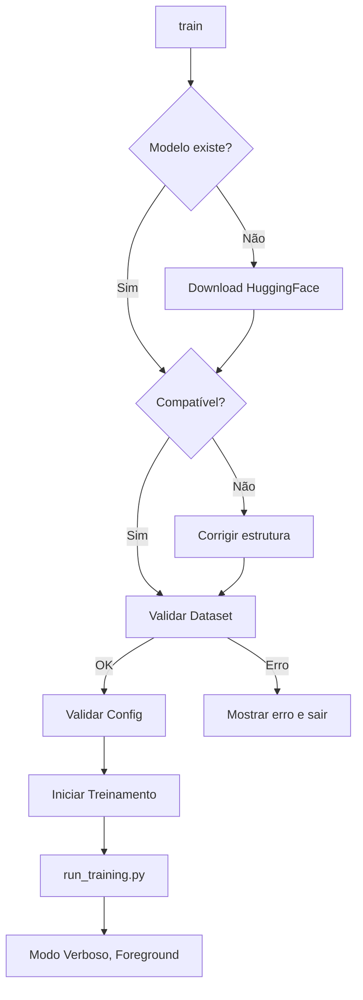

# 🎯 Comando `train` - Pipeline Automatizado F5-TTS

## 🚀 Instalação (Já Feita!)

O comando `train` foi instalado globalmente em `/usr/local/bin/train`.

## 📋 Uso Básico

### Treinar (Pipeline Completo)
```bash
train
```

Isso executa **automaticamente**:
1. ✅ Verifica se modelo pt-BR existe
2. ✅ Baixa do HuggingFace se necessário
3. ✅ Valida compatibilidade do modelo
4. ✅ Corrige estrutura se necessário
5. ✅ Valida dataset completo
6. ✅ Atualiza configuração
7. ✅ Inicia treinamento (modo verboso, foreground)

### Validar Sem Treinar
```bash
train --validate-only
```

Executa passos 1-6 sem iniciar o treinamento.

### Abrir TensorBoard
```bash
train --tensorboard
```

Abre TensorBoard em novo terminal (se possível) ou mostra comando manual.

### Monitorar GPU
```bash
train --monitor
```

Abre monitor de GPU em novo terminal.

### Forçar Re-download
```bash
train --force-download
```

Remove modelo local e força re-download do HuggingFace.

### Ajuda
```bash
train --help
```

## 🔄 Fluxo Automático Completo



## 🎯 Recursos Automatizados

### 1. Auto-Download de Modelo
- Verifica `train/pretrained/F5-TTS-pt-br/pt-br/`
- Se não existir, baixa automaticamente de `firstpixel/F5-TTS-pt-br`
- Usa `huggingface_hub` com resume automático
- Instala dependências se necessário

### 2. Auto-Correção de Compatibilidade
- Verifica estrutura do modelo .pt
- Detecta formato: `model_state_dict` vs `model`
- Corrige automaticamente para formato compatível
- Preserva EMA, optimizer, scheduler
- Gera `model_200000_fixed.pt`

### 3. Auto-Validação de Dataset
- Verifica `metadata.csv`, `duration.json`, `vocab.txt`
- Conta arquivos `.wav`
- Mostra estatísticas
- Para execução se incompleto

### 4. Auto-Atualização de Config
- Atualiza `.env` para usar modelo corrigido
- Desabilita auto-download após primeira execução
- Preserva outras configurações

## 📁 Estrutura de Arquivos

```
train/
├── train                          # ⭐ Comando principal
├── install_train_command.sh       # Instalador
├── scripts/
│   ├── auto_train.py              # Pipeline automatizado
│   ├── vscode_terminal.py         # Launcher de terminais
│   ├── check_model.py             # Verificação de modelos
│   └── validate_setup.py          # Validação manual
└── ...
```

## 🔧 Componentes

### `train` (Wrapper Principal)
- Ponto de entrada único
- Argumentos de linha de comando
- Chama `auto_train.py`

### `auto_train.py` (AutoTrainer)
- **Classe AutoTrainer**: Orquestra todo o pipeline
- **ensure_model()**: Verifica/baixa modelo
- **validate_and_fix_model()**: Valida e corrige
- **validate_dataset()**: Valida dataset
- **start_training()**: Executa treinamento

### `vscode_terminal.py` (VSCode Launcher)
- Abre terminais no VSCode ou sistema
- Suporte a: `code`, `gnome-terminal`, `xterm`, `konsole`, `tmux`
- Fallback para execução manual

## 🎮 Exemplos de Uso

### Uso Típico (Primeira Vez)
```bash
# 1. Validar setup
train --validate-only

# 2. Se tudo OK, treinar
train

# 3. Em outro terminal, monitorar
train --tensorboard
```

### Continuar Treinamento
```bash
# O script detecta automaticamente checkpoint existente
train
```

### Resetar e Recomeçar
```bash
# Baixar modelo novamente
train --force-download

# Limpar checkpoints
rm -rf train/output/ptbr_finetuned/*.pt

# Treinar do zero
train
```

## 🐛 Troubleshooting

### Modelo não baixa
```bash
# Instalar huggingface_hub manualmente
pip install huggingface_hub

# Ou baixar manualmente de:
# https://huggingface.co/firstpixel/F5-TTS-pt-br/tree/main/pt-br
# Salvar em: train/pretrained/F5-TTS-pt-br/pt-br/model_200000.pt
```

### Dataset não encontrado
```bash
# Verificar se existe:
ls train/data/f5_dataset/

# Deve conter:
# - metadata.csv
# - duration.json
# - vocab.txt
# - wavs/*.wav
```

### Terminal VSCode não abre
- Normal em ambientes headless
- Use comandos manuais mostrados no output
- Ou use `tmux`/`screen`

### Erro de permissão
```bash
# Reinstalar comando
sudo /home/tts-webui-proxmox-passthrough/train/install_train_command.sh
```

## 📊 Comparação: Antes vs Agora

### Antes (Manual)
```bash
# 1. Verificar modelo
ls train/pretrained/F5-TTS-pt-br/pt-br/

# 2. Se não existir, baixar manualmente
# 3. Verificar estrutura
python3 scripts/check_model.py model.pt

# 4. Corrigir se necessário
python3 scripts/check_model.py model.pt --fix

# 5. Validar dataset
python3 scripts/validate_setup.py

# 6. Atualizar .env manualmente

# 7. Iniciar treinamento
cd /home/tts-webui-proxmox-passthrough
python3 -m train.run_training

# 8. Abrir TensorBoard em outro terminal
cd train
tensorboard --logdir runs --port 6006
```

### Agora (Automatizado)
```bash
train
```

## ✅ Vantagens

1. **Zero Configuração Manual**: Tudo automático
2. **Auto-Correção**: Detecta e corrige problemas
3. **Validação Integrada**: Garante que setup está correto
4. **Modo Verboso**: Vê tudo que acontece
5. **Foreground**: Ctrl+C para parar facilmente
6. **Idempotente**: Rodar múltiplas vezes é seguro
7. **Resiliente**: Trata erros graciosamente

## 🚀 Próximos Passos

Agora é só executar:

```bash
train
```

E o sistema cuida de todo o resto! 🎉
